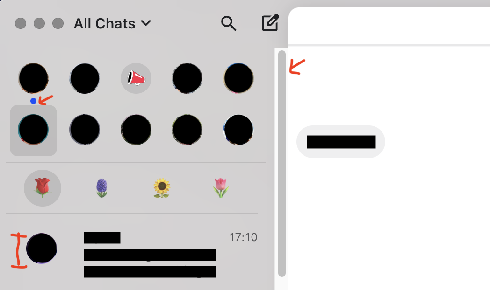

# Beeper Custom CSS

This repository contains custom CSS styles for Beeper.app. It uses a symlink setup to automatically apply any changes you make to the CSS file.

## Issue tracker

📝 TODO
🛠️ WIP (work in progress)
🐛 Bug
✅ Done

- ✅ Make AccountFilters compact (emojis)
- ✅ Add dividers
- 🛠️ Make PinnedThreads compact
  - ✅ Styling groundwork
  - 🛠️ Deal with unreadIndicator (check screenshot)
  - ✅ Avatars of non-pinned threads re-sized
- ✅ Show an emoji when no threads are present 🤫
- ✅ Show only the beeper logo on the welcome screen 🤫
- 📝 Make threads compact
- 📝 Do something about the scrollbar
- 💡 Let me know your ideas

### Preview




## Setup

1. Clone this repository:
```bash
git clone https://github.com/clins1994/beeper-custom-css.git
cd beeper-custom-css
```

2. Run the setup script:
```bash
chmod +x setup.sh
./setup.sh
```

The setup script will:
- Check if custom.css exists in the repository
- Backup your original custom.css file (if it exists) as custom.css.bak
- Create a symlink from Beeper's directory to your repository file

## Using Custom CSS

1. Edit the `custom.css` file in this repository
2. In Beeper, type "Reload custom CSS" in the command bar to see your changes

Tip: on mac you can open dev tools from beeper with the shortcut CMD + OPTION + I since it is an electron app

## Undoing Changes

If you want to revert to your original CSS:

1. Run the undo script:
```bash
chmod +x undo.sh
./undo.sh
```

The undo script will:
- Remove the symlink
- Restore your original CSS file from the backup
- Delete the backup file

## Notes

- The CSS file is located at: `~/Library/Application Support/BeeperTexts/custom.css`
- Changes made to the file in this repository will automatically be reflected in Beeper (just need to click Reload custom CSS)
- If you need to restore your original CSS, it's backed up as `custom.css.bak` in the Beeper directory

## Contributing

Feel free to submit pull requests with your custom CSS styles!
